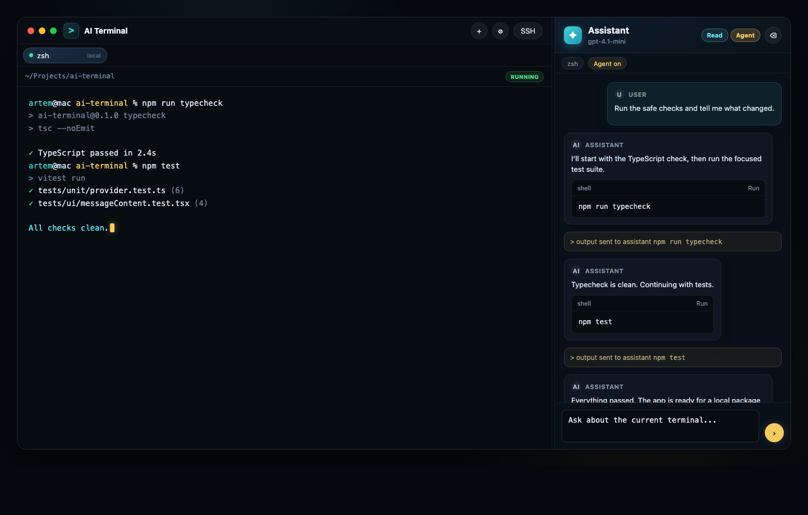

# AI Terminal

<p align="center">
  
</p>

<p align="center">
  <strong>A macOS terminal with an AI agent beside your shell.</strong>
  <br>
  Real local PTY sessions, SSH that respects your existing setup, and an assistant that can read context, propose commands, and run safe steps with approval when needed.
</p>



## Demo


## Why AI Terminal

AI Terminal is a desktop terminal for developers who want LLM help without giving up a real shell. It keeps the terminal local and familiar, then adds a focused assistant panel for reading output, explaining commands, and helping automate small workflows.

The app is built for macOS first. Local sessions run through `node-pty`, SSH uses the system `ssh` binary, and provider configuration works with OpenAI-compatible APIs.

## Highlights

- Real local terminal sessions with `xterm.js` and `node-pty`.
- SSH connections through system OpenSSH, including `~/.ssh/config`, ssh-agent, keys, and ProxyJump.
- Right-side assistant panel that can use selected text and recent terminal output as context.
- Read-only mode for explanations and command suggestions.
- Agent mode for step-by-step command execution in the active terminal.
- In-app confirmation before risky commands are run.
- Runnable fenced shell blocks in assistant replies.
- Markdown-ish assistant rendering, including tables and code blocks.
- OpenAI-compatible provider settings with searchable model pickers.
- API keys stored in the OS keychain through `keytar`.

## Assistant Modes

AI Terminal separates passive help from active automation:

- **Read mode** lets the assistant inspect terminal context and answer without touching the shell.
- **Agent mode** asks the model for exactly one shell command at a time, checks command risk, then runs safe commands in the active terminal.
- **Risky commands** require an in-app confirmation modal before execution.

Command output is sent back to the assistant as context and appears in the chat as a subtle system-style item, so the thread stays readable.

## Providers

AI Terminal uses OpenAI-compatible endpoints:

- model listing from `{baseUrl}/v1/models`
- streaming chat from `{baseUrl}/v1/chat/completions`
- a separate selected model for command-risk checks

ChatGPT Plus is not an API entitlement. Use an API key from OpenAI Platform, OpenRouter, LM Studio, or another compatible gateway.

## Development

```bash
npm install
npm run dev
```

## Checks

```bash
npm run typecheck
npm run test
npm run build
```

## macOS Package

```bash
make build
```

The package is written to `dist/` as a `.pkg` installer and a `.zip` containing the macOS app. Local builds are unsigned unless a Developer ID signing identity is configured on the machine.

## Manual QA

1. Start the app with `npm run dev`.
2. Confirm a local shell opens and accepts input.
3. Select terminal output and ask the assistant about it.
4. Configure an OpenAI-compatible `baseUrl`, save the API key, load models, and select chat and safety models.
5. Ask for a harmless command such as listing the current directory.
6. Verify agent mode runs a safe command in the active terminal.
7. Ask for a risky command and verify the in-app confirmation appears before execution.
8. Open an SSH session using a host from `~/.ssh/config` or a direct host/user pair.
