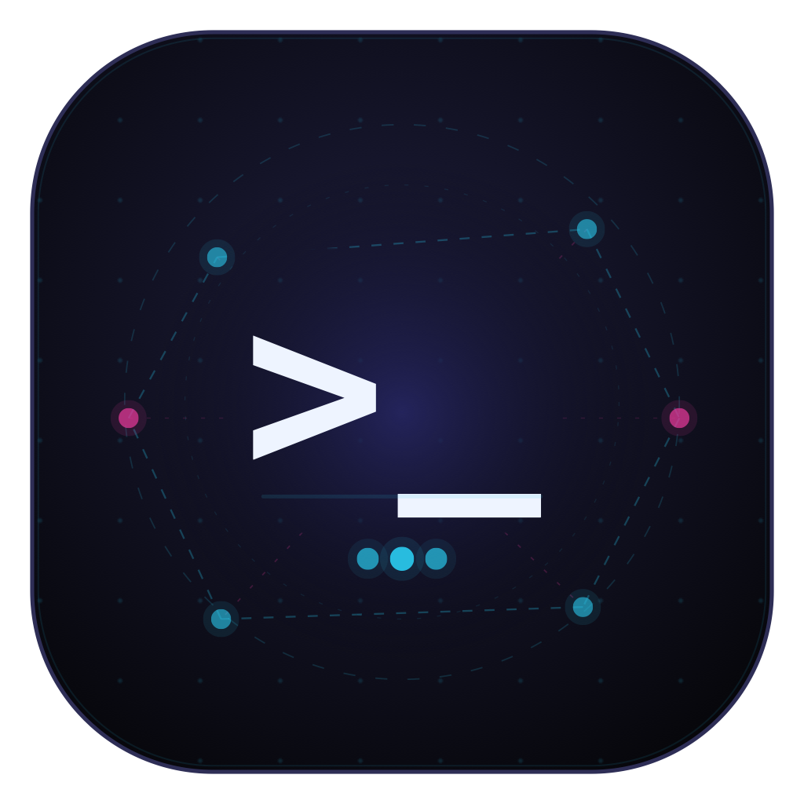
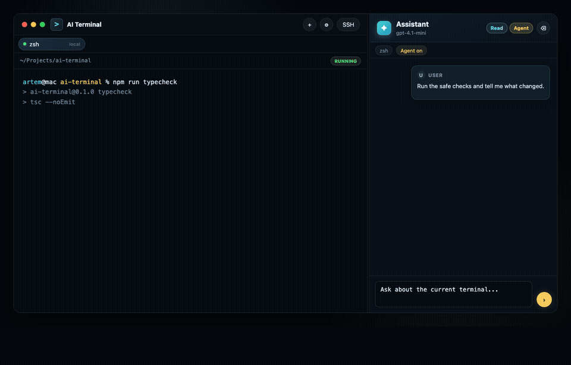

# AI Terminal

<p align="center">
  
</p>

<p align="center">
  <strong>A macOS terminal with an AI assistant built in.</strong>
  <br>
  Ask questions, get command suggestions, and let the AI run steps for you — all without leaving your terminal.
</p>

<p align="center">
  
  
  
</p>

<p align="center">
  
</p>

## What it does

AI Terminal is a regular terminal app for macOS with an AI chat panel on the right side. You can open local shell sessions or connect to remote servers over SSH, then ask the assistant anything about what's happening on screen.

The assistant can explain output, suggest commands, or — in agent mode — run a sequence of commands on its own, one step at a time, asking for your approval before anything potentially risky.

## Key features

- **Local terminal** — open a shell on your Mac just like any other terminal.
- **SSH support** — connect to remote servers using your existing SSH config, keys, and jump hosts.
- **AI chat panel** — ask the assistant about selected text or recent terminal output.
- **Agent mode** — the assistant proposes and runs commands step by step, explaining each one.
- **Safety confirmations** — risky commands always require a click to approve before they run.
- **Any AI provider** — works with OpenAI, OpenRouter, LM Studio, or any compatible API.

## Getting started

### Download (recommended)

Grab the latest `.zip` from [Releases](https://github.com/Doka-NT/ai-terminal/releases), unzip it, and drag **AI Terminal.app** to your Applications folder.

> **First launch:** macOS will warn that the app is from an unidentified developer. Right-click → **Open** → **Open** to proceed.
> Or run: `xattr -dr com.apple.quarantine "/Applications/AI Terminal.app"`

### Build from source

```bash
git clone https://github.com/Doka-NT/ai-terminal.git
cd ai-terminal
make build
```

Open `dist/`, unzip the archive, and drag **AI Terminal.app** to your Applications folder.

On first launch, go to **Settings → Providers** and add your API key and base URL. Then pick a model and start a session.

---

## Development

**Checks:**

```bash
npm run typecheck && npm run test
```

**Build macOS package:**

```bash
make build
# Output: dist/*.pkg and dist/*.zip (unsigned)
```
